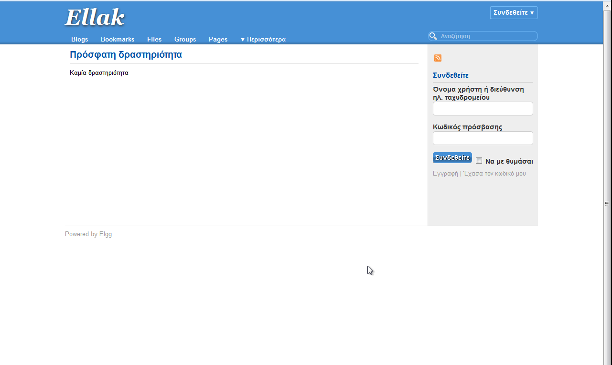
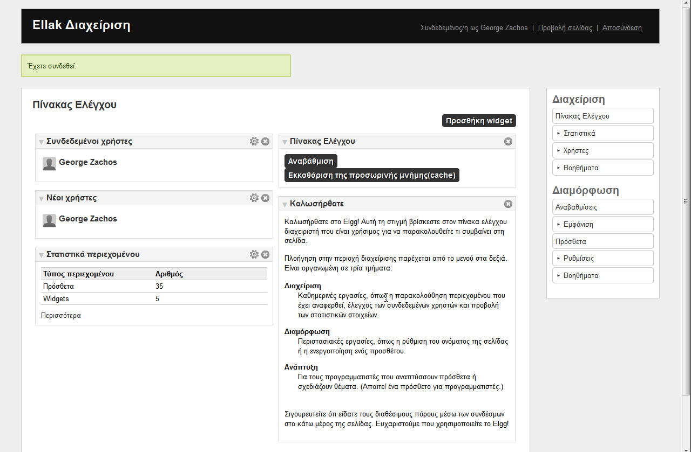
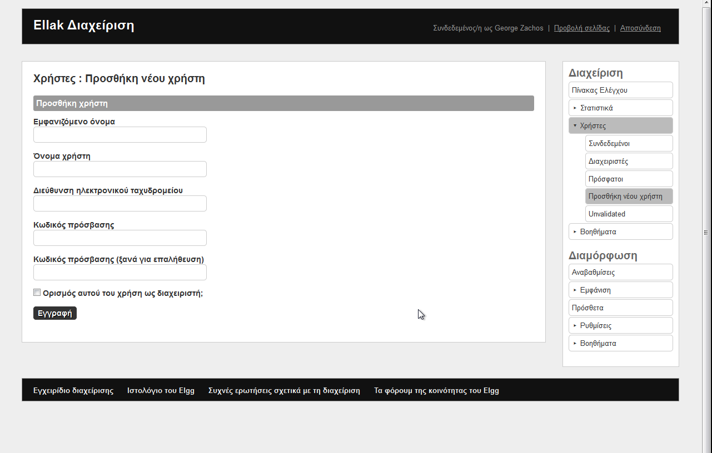
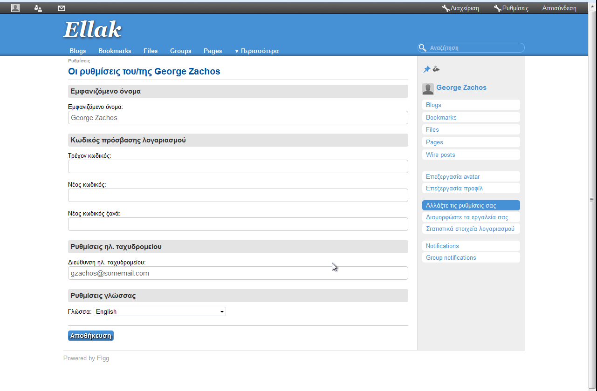
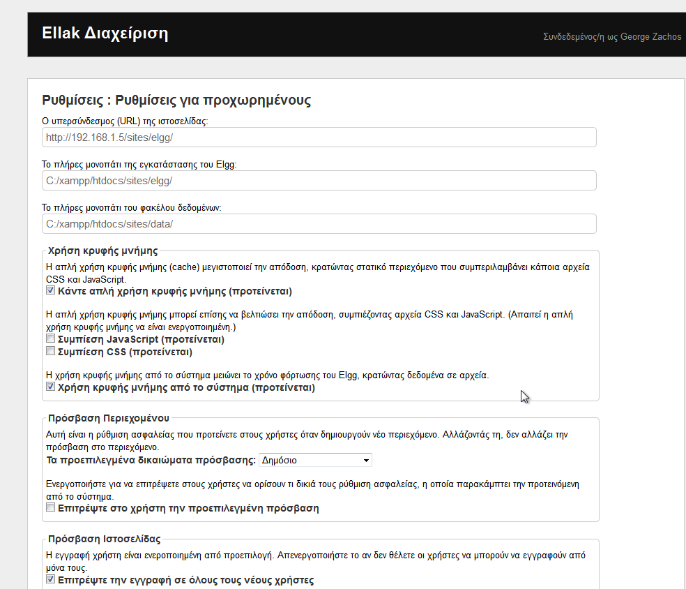

elgg
======

About this repository
-----

>This is a repository used for the localization of Elgg social networking engine - version 1.9 .
>There are no significant differences between version 1.9 and 1.10, so both versions will finally be localized.

The Organization responsible
-----

>University of Ioannina Unit of Excellence -
>Greek Free and Open Source Software Society (GFOSS)

About Elgg
-----
>Elgg is an open source social networking software that provides individuals
>and organizations with the components needed to create an online social environment.
>It offers blogging, microblogging, file sharing, networking, groups and a number of
>other features. It was also the first platform to bring ideas from commercial social
>networking platforms to educational software.

License
-------
Elgg is released under the GNU General Public License (GPL) Version 2 and the Massachusetts Institute of Technology (MIT-X11) License.

Translation type
-----
>From English to Greek

Screenshots
-----------
(Do not depict the most recent website view)

 _Login_ 

 _Control Panel_ 

 _User Addition_ 

 _Profile Settings_ 

 _Advanced Settings_ 

Translation Progress by Sections
-----

(Ready to push to the official Elgg repository)
 - [x] __Sites__
 - [x] __Sessions__
 - [x] __Errors__
 - [x] __User Details__
 - [x] __Access__
 - [x] __Dashboard and widgets__
 - [x] __Groups__
 - [x] __Users__
 - [x] __Friends__
 - [x] __Feeds__
 - [x] __Links__
 - [x] __River__
 - [x] __Notifications__
 - [x] __Search__
 - [x] __Account__
 - [x] __Administration__
 - [x] __Plugins__
 - [x] __User Settings__
 - [x] __Activity river__
 - [x] __Icons__
 - [x] __Generic action words__
 - [x] __Generic questions__
 - [x] __Status__
 - [x] __Generic sorts__
 - [x] __Generic data words__
 - [x] __Entity actions__
 - [x] __Input / output strings__
 - [x] __User add__
 - [x] __System messages__
 - [x] __Import / export__
 - [x] __Time__
 - [x] __System settings__
 - [x] __Welcome__
 - [x] __Emails__
 - [x] __user default access__
 - [x] __Comments__
 - [x] __Entities__
 - [x] __Action gatekeeper__
 - [ ] __Word blacklists__
 - [x] __Tag labels__
 - [x] __Javascript__
 - [x] __Miscellaneous__
 - [x] __Languages according to ISO 639-1__

Completed Parts
-----

(Ready to push to the official Elgg repository)
 - [x] P1: Sessions and Errors
 - [x] P2: User Details - Account
 - [x] P3: Administration
 - [x] P4: Plugins
 - [x] P5: User settings - Time
 - [x] P6: System settings
 - [x] P7: Welcome - Miscellaneous
 - [x] P8: Languages

Notes
----

 * _Note that only the final el.php document(s) will be pushed to this repository._
 * __en-local.php__ _is the PHP file that is currently translated._
 * __en-v9.php__ _is the PHP file of ELGG version 1.9_
 * __en-v10.php__ _is the PHP file of ELGG version 1.10_

